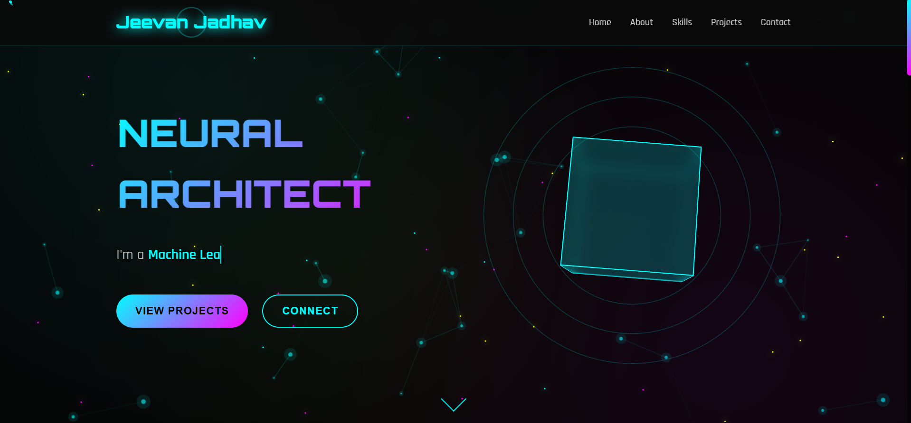
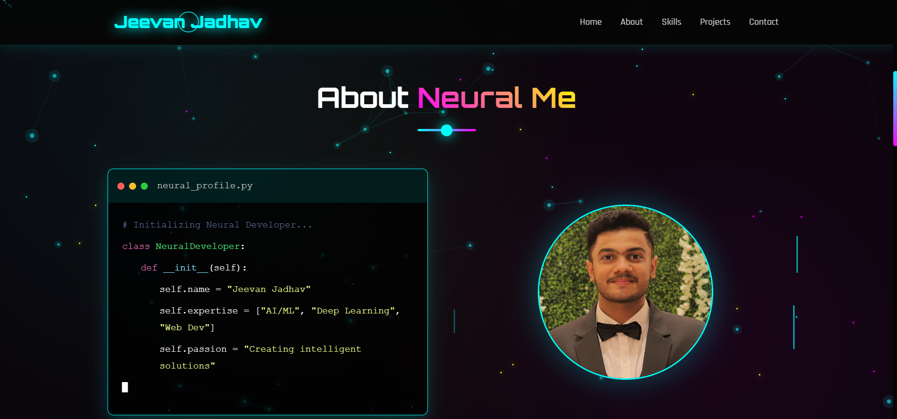

# Portfolio Template 1

A sleek, customizable portfolio web template built with HTML, CSS, and JavaScript. Ideal for developers, designers, or creatives looking to showcase their projects, skills, and contact information with a modern look and interactive experience.

  


---

##  Features

- **Clean Modern Design** – Minimalistic layout that places the spotlight on your work.
- **Responsive & Mobile-Ready** – Adapts gracefully to all screen sizes.
- **Interactive Elements** – Smooth animations and transitions powered by JavaScript.
- **Easy to Customize** – HTML structure, styling, and scripts are easy to adapt.
- **MIT Licensed** – Open-source and free for any use :contentReference[oaicite:1]{index=1}.

---

##  Getting Started

### Prerequisites

No installation is required—all you need is a modern web browser.

### Setup

1. Clone the repo:
   ```bash
   git clone https://github.com/NOVA0206/Portfolio-Template-1.git
   cd Portfolio-Template-1
   ```
   
2. Open `Portfolio1.html` in your preferred browser—or serve locally for live reloading:

   ```bash
   # Using Python 3.x
   python3 -m http.server 8000
   ```
3. Customize:

   * Edit the HTML (`Portfolio1.html`) for content and layout.
   * Edit `style1.css` to tweak colors, fonts, and layout.
   * Adjust interactivity in `script1.js` as needed.

---

## Usage Suggestions

* Perfect for showcasing your personal work, projects, blog entries, or design portfolio.
* Add sections like `About Me`, `Projects`, `Skills`, `Contact`, or `Testimonials`.
* Integrate external resources—like icon sets, fonts, animations—to enhance appearance.

---

## File Overview

| File              | Purpose                                   |
| ----------------- | ----------------------------------------- |
| `Portfolio1.html` | Main HTML template for the portfolio page |
| `style1.css`      | Handles styling and visual layout         |
| `script1.js`      | Adds dynamic behavior and effects         |
| `LICENSE`         | MIT License for free and open usage       |

---

## License

This project is released under the **MIT License** — see the [LICENSE](LICENSE) file for details. 

---

## Contributing

Contributions, suggestions, and feedback are welcome! Feel free to open an issue or submit a pull request to improve or expand the template.

---

## Contact

Built with passion by Jeevan Jadhav.
– Email: `jeevanj020604@gmail.com`
Let’s connect!

---
